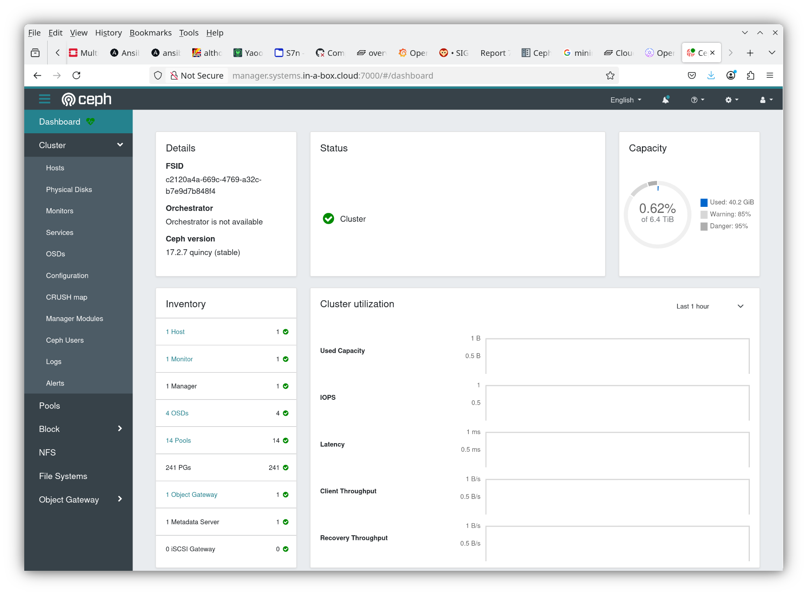
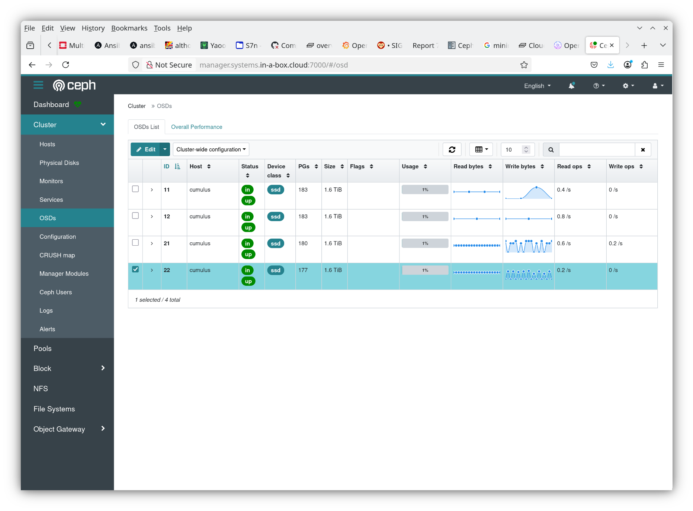
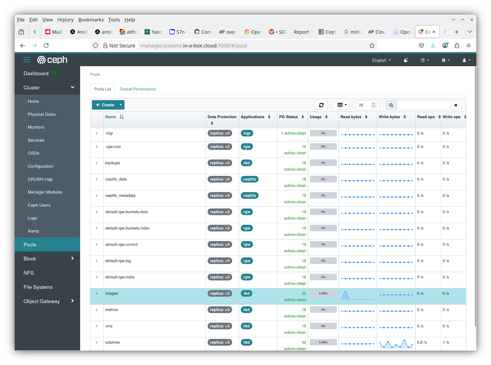
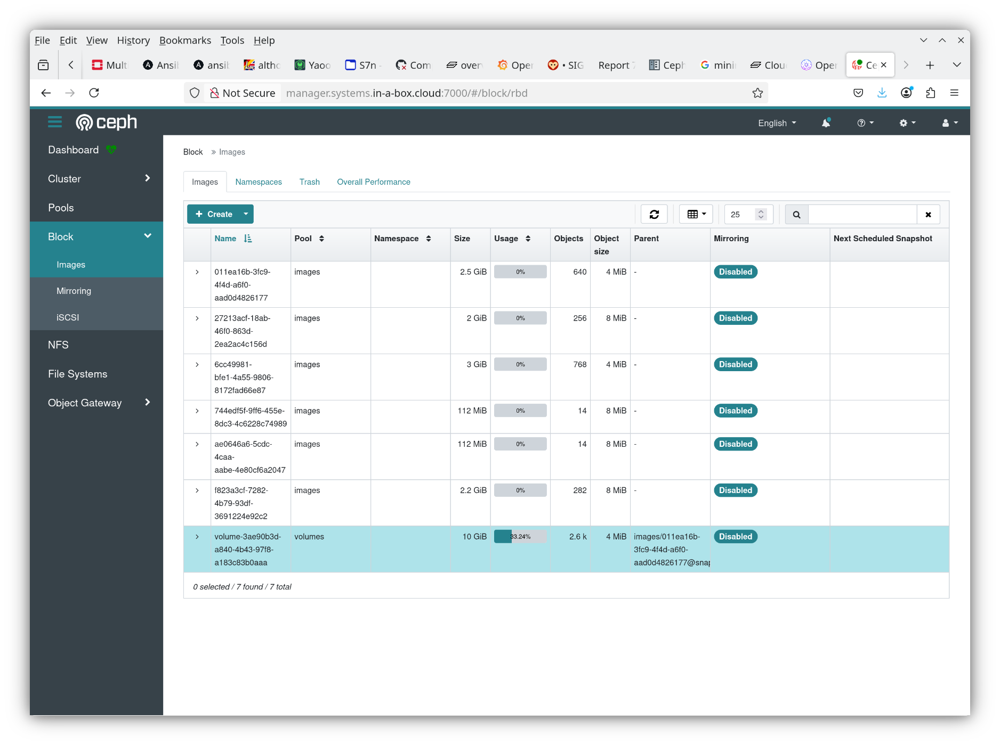

## Introduction to CEPH

### What is ceph?
* Distributed storage system
    - Performance (throughput) scales with the size of the Ceph cluster
    - Robustness by replication (or erasure-coding)
    - Data is stored on OSDs (Object Storage Devices)
    - Avoiding bottleneck by direct communication between client and OSD (CRUSH map)
    - Object and data scrubbing
    - Invented 2009 by Sage Weil (@Inktank, later acquired by RedHat)
* Provides Object Storage (rados gateway aka rgw with S3 and Swift protocol suppport),
  Block Storage (rados block device, rbd) and file system (cephfs) support.
* Cephx authentication: Kerberos-like tickets can be retrieved via a shared secret and
  grant time-limited access to clients.
* Proven in enterprise environments for heavy-duty block and object storage needs
    - De facto OSS reference that everyone benchmarks against
* Alternatives:
    - OSS: drbd, glusterfs, ...
    - Commercial: Huawei FusionStorage, PureStorage, Scality, NetApp, vSAN, ...

### Ceph terminology
* Read <https://docs.ceph.com/en/latest/architecture/>
* Ceph Monitor cluster (Mons) maintains the *cluster state* (maps)
    - Cluster Map contains `FSID`, list of pools, placement groups, OSDs, crush map
* Ceph Manager povides that administrative interfaces and additional monitoring
    - It runs typically alongside the Mons and is required these days for normal operation
* OSDs keep the data by writing them to local storage and by replicating them to other OSDs
    - Several options exist for local storage, preferred format is bluestore nowadays
    - Can separate data from metadata drives, the latter being more important for performance
    - OSDs are aware of their neighbours and report failures to contact them to mons
* Data is sorted into *pools*
    - Pools can have their individual replication strategy, scrubbing policy etc.
    - A pool has a set of *placement groups* associated with it
* Clients need to calculate the placement group of an object via CRUSH algorithm
    - Hashing the object ID resulting in an identifier `<POOLID>.<PG>`
    - From the *placement group*, the *Acting Set* can be determined. The Acting Set 
      is a list of OSDs responsible for this PG.
    - Clients can only issue writes to the *Primary* (first member of the PG) who is
      then responsible to replicate the data to the *Secondaries*.

### Ceph replication strategies
* Replication strategy is set by pool
* For high availability `size=3`, `min_size=2` is typically used
    - Each object is written to three OSDs.
    - Data integrity can be ensured as long as two OSDs are accessible (`in` and `up`).
* 3x replication is the standard Ceph storage strategy
    - It is very robust
    - High performance reads
    - Easy scrubbing
    - Net capacity is only 1/3 of gross capacity
* Alternative is erasure coding ("RAID-6 like")
    - Data is split off into a number of K chunks
    - A few more (M) chunks are calculated
    - These chunks are distributed over K+M OSDs
    - Any set of K chunks is sufficient to calculate the data
    - Somewhat compute intensive (for writing and scrubbing)
    - Net capacity is K/(K+M) of gross capacity, e.g. 3/(3+2) = 60%
    - Considered less proven than 3x replication

### Block storage: Rados Block Device
* Client code that exposes ceph storage as a block device ("image")
    - A set of freely addressable blocks
    - Like a disk
* Stores blocks of e.g. 4MB as ceph rados objects
* Available as linux kernel driver (rbd) and supported by libvirt
    - Acts like other block devices (e.g. SCSI disks)
* Block size considerations:
    - Writes cause Read-Modify-Write cycles, which becomes worse for larger blocks
      (and requires caching for mitigation)
    - Lots of small blocks cause a huge amount of objects
* RBD integrates nicely with OpenStack cinder
* RBD even used as "ephemeral, local" storage for OpenStack flavors by some providers
    - Pro: Makes live migration work without block migration
    - Con: Local storage does not have the expected performance characteristics

### Object storage: Rados Gateway (rgw)
* Expose object storage interface for ceph objects
    - Supports S3 API
        - without necessarily imposing the bucket number and global bucket namespace limitations of AWS
    - Supports Swift API
        - exposing the same objects as via S3 (a Swift Container is an S3 Bucket)
* Popular for CSPs that use Ceph for Block Storage anyway
    - However a secondary storage pool may be desirable anyhow
    - OpenStack Swift is an extremely mature and scalable alternative
        * Arguably, the only software component of OpenStack that was stable when OpenStack launched in 2010
* Uses pools `.rgw.root`, `default.rgw.buckets.index`, `default.rgw.buckets.data`, `default.rgw.control`,
    `default.rgw.log`, and `default.rgw.meta` on a standard OSISM ceph-ansible installation.

### File Storage: CephFS
* A layer on top of ceph objects that exposes them as a POSIX-like distributed filesystem
* Starts the MetaData Service Daemon (MDS)
* Stores metadata for the filesystem hierarchy (in pools `cephfs_metadata`) and file data (in pool `cephfs_data`)
* Linux Kernel driver for cephfs exists
* OpenStack Manila driver exists to provide access as shared filesystem
    - Can be used to provide K8s rwx (read-write many) storage
* Conservative storage people consider CephFS as not yet sufficiently proven
    - POSIX filesystems have a surprising amount of complexity due to locking needs to avoid races between
      renames, deletions, writes etc.
    - Cache coherency is a challenge for distributed filesystems (and was not satisfactorily tackled
      on NFS prior to v4.1)

### Ceph versions
* There is roughly one new stable release per year (spring), with version number N.2.0
    - Bugfixes (typically backports) result in N.2.X patch releases (4-6 weeks)
    - Bugfixes provided upstream for 2 years
* Rolling (online) updates supported from previous two stable releases
* "Oceanic" release names, with increasing first letters
* Ceph users tend to be conservative and adopt new stable releases late
    - Storage *is* valuable
    - OSISM currently offers Quincy (17.2.x) and Reef (18.2.x)
* See <https://docs.ceph.com/en/latest/releases/#ceph-releases-index>

## Ceph Dashboard

### Where?
* The Ceph Dashboard is available at <https://manager.systems.YOURCLOUDDOMAIN:7000/>,
  e.g. on <http://manager.systems.in-a-box.cloud:7000/> on a CiaB system
  (after connecting via the wireguard tunnel).
* All dashboards on a CiaB system are linked from
  <https://docs.scs.community/docs/iaas/deployment-examples/cloud-in-a-box/#webinterfaces>.
  Remember that you will need to import the CA certificate or trust the certificate from
  CiaB interfaces.
* The homer service also links some dashboards.
  Homer is at <https://homer.services.YOURCLOUDDOMAIN/>

### Ceph Dashboard: Main page

* Health Status
* Capacity (gross)
* Activity
* Stats (Inventory)

### Ceph Dashboard: OSDs

* List of OSDs with their status
* Administrative actions (e.g. throwing OSDs out) by checking them and using the Edit button
* Be careful!
* Screenshot taken from a CiaB Ceph (reconfigured for 2 LVs on each of the 2 NVMes)

### Ceph Dashboard: Pools

* List taken from CiaB install (number of PGs reduced for less used pools)
* Clients and replication settings displayed
* Note that lists are typically paginated (only show 25 entries per page)

### Ceph Dashboard: Images

* A few OS images (names correspond to glance IDs)
* A 10GB volume as child from image (names correspond to cinder IDs)

## Ceph Command line tooling

### Command line tools
* Are installed in the `cephclient` container on the manager node
    - Beware of extra `\r` (`^M`) in output from docker (depends on your setup)
      when creating scripts
* Expose the full functionality (more comprehensive than the dashboard)
* Needed for automation (scripts, playbooks, ...)

### Information and stats
* `ceph health`
* `ceph status`
* `ceph -w`     # watch health msgs
* `ceph osd status`
* `ceph osd tree`
* `ceph osd df`
* `ceph osd pool stats`
* `ceph osd pool ls detail`
* `ceph pg stat`
* `ceph pg ls-by-pool volumes` # this takes a while
* `rbd -p images ls`    # List RBD objects in image pool, `-p volumes` is interesting as well

### Explore, get and set config options
* `ceph config ls`
* `ceph config get osd.11 bdev_enable_discard`
* `ceph config set osd.11 bdev_enable`  # Do this for all devices if you go for it
* `ceph config set osd.11 bdev_async_discard true`  # Ditto

### OSD operations
* Taking an OSD (ID `NN`) out for good
```bash
ceph osd crush reweight osd.NN 0.0
# Wait for rebalancing (check with ceph osd safe-to-destroy NN)
ceph osd out osd.NN
systemctl disable --now ceph-osd@NN
ceph osd purge osd.NN
```
* Do this for all OSDs on a node (use `ceph osd tree` to find out) ...
    - Expect this to take time, rebalancing moves a lot of data
    - Final step can be done with `osism apply ceph-shrink-osd -e ireallymeanit=yes -e osd_to_kill=NN,MM,...`
    - `ceph osd crush remove nodename`

* Remove broken disk
```bash
ceph osd out osd.NN
systemctl stop ceph-osd@NN
systemctl disable ceph-osd@NN
```
* See more examples in <https://docs.scs.community/docs/iaas/guides/operations-guide/ceph/>

* Upstream ceph docu: <https://docs.ceph.com/en/reef/rados/operations/>
  (This is for reef, use the version that you have in use.)

### Ceph tuning
* See hints at <https://docs.scs.community/docs/iaas/guides/configuration-guide/ceph/>
* Kernel sysctl settings: Typically suitable out of the box in OSISM deployment
* Defaults for PGs are set for a small cluster. Enable autoscaler for pools or increase manually for larger clusters (10+ OSDs)
* There are also hints how to setup WAL and DB if those are not co-located on the same NVMe anyway

## Planning hardware for Ceph

### Considerations
* Store one OSD on one device
    - So one server with 4 NVMEs should host 4 OSDs
    - If you can, keep separate (small) boot drives
* All-flash is preferable
    - Then you can just create a bluestore `ceph-volume lvm create --bluestore --data /dev/osd-vgX/osd-X1 --osd-id YX1`
      to have data, WAL and DB on the same device.
      (This example assumed you have created a Volume Group `osd-vgX` on NVMe number `X` (`/dev/nvmeXn1`) on node no `Y`).
    - If you use rotating storage (classical disks), ensure you split out WAL and DB and put those on SSD/NVMe storage.
    - Only consider rotating disks if you want to store large amounts of object storage data and you can live with
      lower performance. Create a pool with fast solid-state storage for fast volume storage then. (You can have several.)
    - Some flash devices promise better performance when using 4k instead of (default) 512B sectors; you need to reformat
      them if you want to use this (losing all data on them!), see <https://docs.scs.community/docs/iaas/guides/operations-guide/ceph/#check-format-of-a-nvme-device>
* Invest into Enterprise SSD/NVMe
    - 5y @ 3 DWPD rating recommended when exposed as high performance block storage
    - Power Loss Protection allows safe write caching (required by SCS flavor spec for local storage)

### Encryption
* Encryption of data-at-rest is possible by using dm-crypt (LUKS)
    - Costs [some performance](https://scs.community/2023/02/24/impact-of-disk-encryption/)
    - CPU impact not too bad for modern CPUs with hardware AES support
    - You might offer several storage classes, some with and some without encryption, so users can chose between
      performance and highest security requirements
    - Allows easy disposal of broken drives (and avoids worry of stolen drives)
        * It's possible to use self-encrypting device features instead, but that poses operational challenges
          with most BIOSes (which wait for a password to boot, sigh).
    - Example: See testbed config

### Network, I/O, reserverations
* Ensure low-latency, high-bandwidth networking between Ceph OSD nodes
    - Replication and rebalancing can easily saturate two 25GBps links
        * No surprise considering that a single 4x PCIe v4 NVMe has up to 7.5GB/s bandwidth,
          saturating 2x25Gbps network links
    - Put storage traffic on a separate network or do some QoS to avoid ceph starving
      user data and/or control traffic
* Storage nodes obviously need lots of I/O bandwidth
    - Many 4x M.2 PCIe slots for NVMEs; SAS with 12Gbps (or SATA with 6Gbps) is no comparison
      to 4x16Gps of a PCIe4 x4 link, PCIe5 is twice as good, but not yet mainstream
    - Even SATA-connected SSD devices are still much better than hard disks due to
      twice the bandwidth and two orders of magnitude better seek times / IOPS.
    - 2x25 Gbps (w/ link aggregation) is good, more (4x25Gbps, 2x40Gbps, 2x100Gbps) is beneficial
    - Reserve one full core (2HTs), 4GB RAM per OSD, an additional core for encryption

## Assignments for Ceph

### Dashboard
* Log in to the dashboard
* Look at Health, OSDs, Pools, RBD images

### Take OSD out and add back in
* Practice this on a non-production system
* Ensure ceph is healthy and has 4 or more OSDs
    - Remember CLI commands?
* Steps:
    - Optional: Change weight to 0, wait for rebalance
    - Mark out, wait for rebalance (if not done before)
    - Stop OSD container (`down`)
* Back in:
    - Start OSD container again (`up`)
    - Mark in
    - Optional: Adjust weights again
    - Watch the rebalancing using dashboard and CLI
* Bonus: Research quick maintenance with `noout` on SCS docu
    - Used for firmware, hypervisor, kernel update
* Bonus: Why would you assign different weights to different OSDs?
    - Perform the commands ...
