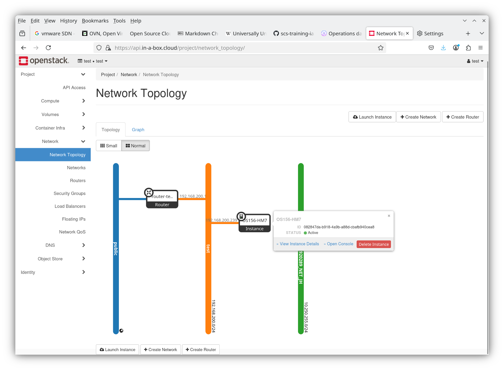
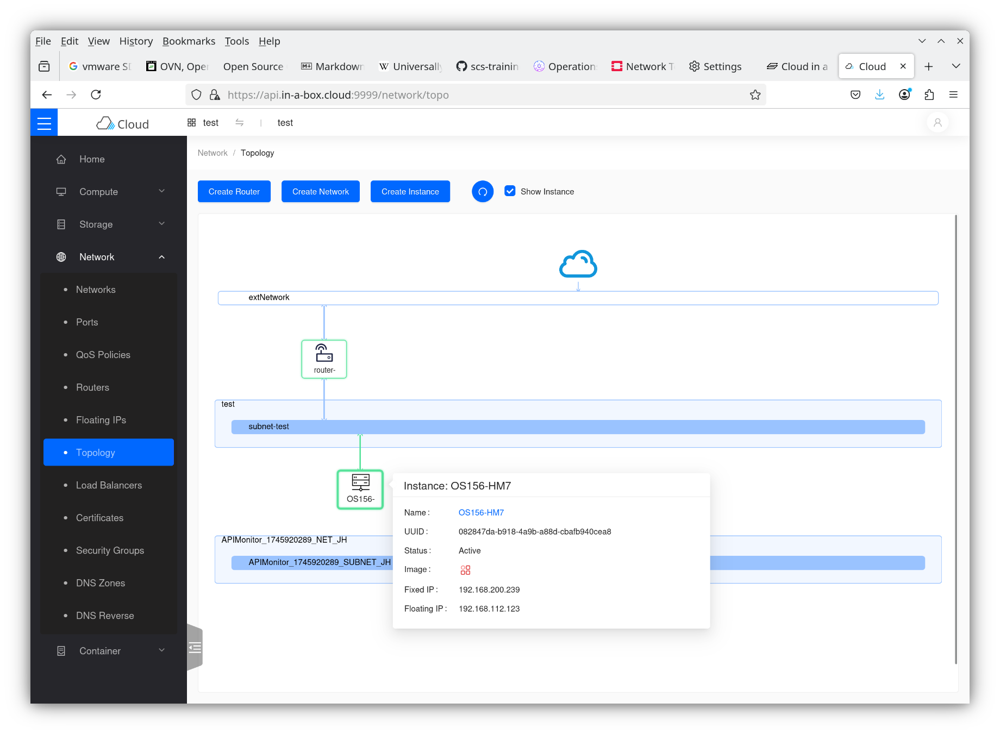

## Virtualization overview

### Virtualizing Hardware

* Applications are written to run on servers
* Virtualization:
    - Create an execution environment for the application that looks like a server (landscape)

#### Types of virtual hardware
* Compute virtualization:
    - Virtual CPUs, virtual memory (RAM)
* Storage virtualization:
    - Virtual Harddisks (block storage, "volumes")
    - Shared Storage (NFS/CIFS) and Object Storage options
* Network virtualization
    - Virtual Network Cards (Ports)
    - ... connected to virtual networks, routers, ...
    - Virtual firewalls and load-balancers

#### Advantages
* Assignment granularity
    - Can assign arbitrary amounts (e.g. 4 CPUs, 16 GiB RAM, 155GB disk),
      independent of actual server sizes
        * Of course real hardware must have sufficient capacity
    - Fractional amounts (shared resources) possible
* Changing assignement on the fly
    - aka vertical scaling
    - Hotplug vs. Coldplug (reboots)
* Additional servers, disks, ... for scalable software
    - horizontal scaling
* Procurement delay (weeks) vs. SW provisioning (seconds/minutes at worst)

#### Common technologies
* Compute virtualization
    - VMware ESXi (proprietary)
    - Xen
    - **KVM**
* Storage virtualization
    - SAN (FibreChannel), vSAN
    - NAS (NetApp and friends)
    - **Ceph** (RBD)
* Network virtualization (SDN)
    - VLANs, VxLANs
    - VMware NSX-T
    - Layer3 networks (routed)
    - Cloud: VPC
    - Linux: Bridge
    - OpenvSwitch (OvS) and OVN (Open Virtual Network)

#### Infrastructure-as-Code
* Automate the set up of virtual hardware completely
    - Not just single servers, but complete landscapes for complicated 
      application workloads
    - Tooling: Scripts with CLI tools, SDK (e.g. python, go, ...),
      terraform/opentofu, ansible, pulumi, ...
* Automated tests
    - Now include the complete roll-out of the test infrastructure
    - Can be torn down automatically after the test (to limit cost)
    - Load tests
* Keep state at confined places
    - Database
    - Data volume
    - Configuration repository
* Keep everything else stateless
    - Can always be redeployed
        * In case of failure
        * In case of a security breach
        * For an upgrade
    - Typically scales trivially

### OpenStack Architecture overview

#### What is OpenStack?

A set of services that manages virtualized resources and gives users
interfaces to control these.


#### How is it built?

* API services
    * Independent processes for Compute, Block Storage, Images, Networking, LoadBalancers, Identity, etc.
    * All APIs are RESTful APIs
        * GET, POST, PUT, PATCH, DELETE verbs for list, create, set, change and delete operations
        * Many APIs are paginated, i.e. GET returns only a subset of resources
* Some APIs have background services
    * Conductors, Schedulers, etc.
* Services talk to each other via REST API or via RabbitMQ
* Database keeps tables for the state of resources
    * Tables are each owned by one service
* Identity service has a central role

#### Keystone: Identity service has a central role
* User authenticates to keystone (typically with some secret) and gets a token
* Token can be validated by individual services
* Tokens have a scope that determines what you can do with them
    * Unscoped
    * Domain scope
    * Project scope
* Identity service hosts the service catalogue

#### Keystone: Raw REST API example (against CiaB)
* Discovery (`--cacert ...` needed b/c of self-signed certificate)
  ```bash
  dragon@cumulus(//):~ [4]$ curl -sS -g --cacert "/etc/ssl/certs/ca-certificates.crt" \
      -X GET https://api.in-a-box.cloud:5000/v3 \
      -H "Accept: application/json" | jq .
  ```
  ```json
  {
    "version": {
      "id": "v3.14",
      "status": "stable",
      "updated": "2020-04-07T00:00:00Z",
      "links": [
        {
          "rel": "self",
          "href": "https://api.in-a-box.cloud:5000/v3/"
        }
      ],
      "media-types": [
        {
          "base": "application/json",
          "type": "application/vnd.openstack.identity-v3+json"
        }
      ]
    }
  }
  ```
  The services are versioned and have versioned (and microversioned) APIs.

* Password authentication
  ```bash
  curl -sS --cacert "/etc/ssl/certs/ca-certificates.crt" \
  -X POST https://api.in-a-box.cloud:5000/v3/auth/tokens \
  -H "Accept: application/json" -H "Content-Type: application/json" -d '
  > {
    "auth": {
      "identity": {
        "methods": [
          "password"
        ],
        "password": {
          "user": {
            "name": "test",
            "password": "test",
            "domain": {
              "name": "test"
            }
          }
        }
      }
    },
    "scope": {
      "project": {
        "name": "test"
      }
    }
  }
  ' | jq
  ```
  ```json
  {
    "token": {
      "methods": [
        "password"
      ],
      "user": {
        "domain": {
          "id": "b294a22221d54c909557f23b65a53166",
          "name": "test"
        },
        "id": "b4438103db904341b88e0e5f9d9f5540",
        "name": "test",
        "password_expires_at": null
      },
      "audit_ids": [
        "lmk5WwvXR5eBvBx2Dh2z5w"
      ],
      "expires_at": "2025-05-08T14:38:37.000000Z",
      "issued_at": "2025-05-07T14:38:37.000000Z",
      "project": {
        "domain": {
          "id": "b294a22221d54c909557f23b65a53166",
          "name": "test"
        },
        "id": "0ecdbb271d8245f0b458bc1e4526a133",
        "name": "test"
      },
      "is_domain": false,
      "roles": [
        {
          "id": "4095d94d72cb484b85d204d5b5ef913e",
          "name": "reader"
        },
        {
          "id": "72ca54fa55c24fa69c4bdd0803e8014c",
          "name": "member"
        },
        {
          "id": "aaf15f40660a4e58bcd80b661ca30061",
          "name": "load-balancer_member"
        },
        {
          "id": "0c9a55df33a94b55bdcf7bb652b88e22",
          "name": "creator"
        }
      ],
      "catalog": [
        {
          "endpoints": [
            {
              "id": "3b95334448364dab92bd46e75dcab326",
              "interface": "public",
              "region_id": "RegionOne",
              "url": "https://api.in-a-box.cloud:9998",
              "region": "RegionOne"
            },
            {
              "id": "b74a9a69c48b4f44993d6b6cede248c1",
              "interface": "internal",
              "region_id": "RegionOne",
              "url": "https://api.in-a-box.cloud:9998",
              "region": "RegionOne"
            }
          ],
          "id": "037ce0fe8e5246a58f2ca435e321834f",
          "type": "panel",
          "name": "skyline"
        },
  [...]
        {
          "endpoints": [
            {
              "id": "737da81d4d7e43e7b2d9ced0dec2ab36",
              "interface": "public",
              "region_id": "RegionOne",
              "url": "https://api.in-a-box.cloud:8780",
              "region": "RegionOne"
            },
            {
              "id": "e49affd2bb0341c5ad30cd4b3bd4bb1a",
              "interface": "internal",
              "region_id": "RegionOne",
              "url": "https://api.in-a-box.cloud:8780",
              "region": "RegionOne"
            }
          ],
          "id": "f7a6b12baa5b46c094a647356c7b54b0",
          "type": "placement",
          "name": "placement"
        }
      ]
    }
  }
  ```

* All services are identified by unique 16byte ids, resources also carry 16 byte uuids (typically in 8-4-4-4-12 notation).
  Tools typically support addressing resources by name, but names are *not* enforced to be unique everywhere.

* Much easier: Store keystone endpoint and credentials in `~/.config/openstack/clouds.yaml` and `secure.yaml` and
  issue `openstack --os-cloud test catalog list`.

  `~/.config/openstack/clouds.yaml`
  ```yaml
  ---
  clouds:
    test:
      auth:
        username: test
        project_name: test
        auth_url: https://api.in-a-box.cloud:5000/v3
        project_domain_name: test
        user_domain_name: test
      cacert: /etc/ssl/certs/ca-certificates.crt
      identity_api_version: 3
  ```
  
  `~/.config/openstack/secure.yaml`
  ```yaml
  ---
  clouds:
    test:
      auth:
        password: test
  ```

#### OpenStack Core services
| Type | Name | Function |
|------|------|----------|
| identity | keystone | Identity and Access management |
| network | neutron | Networking (L2+L3) |
| volumev3 | cinder | Block Storage (virtual hard disks) |
| image | glance | Image handling |
| compute | nova | VM management |
| object-store | swift | Object storage (S3-like) -- optional for SCS |

All core services (except Swift) need to be present for SCS-compatible IaaS compliance.
Note on swift: We require an S3 compatible service. (Ideally, both S3 and Swift are offered.)

Note on terminology: OpenStack calls hosts (hardware nodes) hypervisors and VMs instances or servers.

#### Other standard OpenStack services
| Type | Name | Function and Notes |
|------|------|--------------------|
| orchestration | heat | Deploy sets of resources (like cloudformation, heat-cfn) |
| dns | designate | DNS service |
| load-balancer | octavia | L4 and L7 load balancing |
| key-manager | barbican | Secrets management (e.g. for L7 LB, like vault) |

#### Internal OpenStack services
| Type | Name | Function and Notes |
|------|------|--------------------|
| placement | placement | Determine where VMs are started (scheduler), typically only used internally |
| telemetry | ceilometer | Collect usage/metering data (typically not exposed) |

#### Optional OpenStack services
| Type | Name | Function and Notes |
|------|------|--------------------|
| metric | gnocchi | Aggregation of metering data |
| alarming | aodh | Trigger notifications |
| clustering | senlin | Manage sets of resources |
| sharev2 | manila | Shared filesystems (NFS,CIFS,...) |
| baremetal | ironic | Bare Metal instance management |
| container-infra | magnum | Manage container clusters |

Many more "big tent" services exist (trove - database, zaqar - queuing, mistral - workflow,
sahara - big data, cloudkitty - metering, watcher - optimization), see
<https://www.openstack.org/software/>. They have varying degrees of maturity and
they are not supported by default in the SCS reference implementaton.

#### Dashboard: Horizon
Horizon is the traditional dashboard that almost every OpenStack cloud offers.
It takes a bit of time to get used to.



#### Dashboard: Skyline
Skyline is a relatively new project and only offered on some clouds.
It has a more modern look and can easily be extended.



Both dashboards allow to download clouds.yaml or old-style openrc files.

### Internal infrastructure

OpenStack requires queuing and a database to work

* We use mariadb (free version of MySQL)
    - Clustered with galera for high availability
* memcached and/or proxysql for caching (performance)
* Queuing connects publishers and consumers of messages
    * which should be processed in order (FIFO)
    * OpenStack traditionally uses [rabbitmq](https://www.rabbitmq.com/docs/queues) as queuing (AMQP) service
    * We learned to prefer Quorum queues where possible

* OSISM comes with significantly more infrastructure
    * Monitoring
    * Lifecycle management
    * Log aggregation and search
    * k3s Cluster (for extensibility)

### OpenStack user managment

#### Domains and Projects
* Resources belong to projects (formerly called tenants)
* Projects are structured into domains (optional, mandatory in SCS)
* Domains are thus containers (realms) for
    - Projects
    - Users
    - Groups
* `Domain_Name:Project_Name`, `Domain_Name:User_Name`, `Domain_Name:Group_Name`
  tuples are unique identifiers. (The corresponding IDs are unique as well, of course.)
* The `domain_manager` role can be handed to customers to manage projects, users and
  groups on their own (self-service)
    - This is secure (they can not grant themselves rights to projects of other domains)
    - This was introduced by SCS community and only merged upstream in OpenStack 2024.2 (SCS R8).
    - The `admin` can however assign rights across domain boundaries if so wanted (not typically
      a good idea)

#### Role assignments
* Roles are rights (privileges) that users have towards projects
    - For example "User `XYZ@domA` has the right `reader` in project `ABC@domA`.
* Standard roles with increasing level of privilege:
    - Keystone: `reader`, `member`, `manager`, `admin`
    - Most services: `reader`, `member`, `admin`
    - Octavia: `load-balancer_observer`, `load-balancer_member`, `load-balancer_admin`
    - Barbican: `observer`, `creator`, `admin` 
* The special cases for Octavia and Barbican are being worked on in the
    secure RBAC cleanup that is currently happening.
* The `service` roles are internal for communication between services.
* These privileges have a scope, e.g. `project` or `domain` or `system`
* Try `openstack --os-cloud=admin role assignment list --names`
* Normal users require `member` (and `creator` for Barbican and `load-balancer_member` for Octavia) roles
  for their own project(s)
    - Resellers or IT managers would have `manager` privilege for their domain(s)
* Role assignment can be indirected via group membership.

### Security Architecture

#### Compute separation
* Hardware virtualization technology separates VMs from each other
    - SCS mandates microcode and hypervisor/kernel mitigations to be active against known CPU vulnerabilities
    - SCS mandates Hyperthreading to be switched off if it's not secure ([scs-0100](https://docs.scs.community/standards/scs-0100-v3-flavor-naming))
* Highest security environments might want to use dedicated hosts or assign dedicated host groups (host aggregates) to avoid sharing hardware with untrusted users.

#### Network separation
* User-controlled networks are separated using encapsulation or VxLAN technology
* Internal control traffic is encrypted (https)
* User plane traffic can be encrypted by application operator, optionally using container side-cars or optionally done at the virtualization layer (at the cost of performance)

#### Storage separation
* ceph enforces storage isolation
* users can use luks for sensitive data
* optional disk encryption, exposed via storage class

#### Archictecture
* Secrets are stored in ansible vault or external vaults (keepass, hashicorop vault/openbao)
* Internal control traffic encrypted
* Secure delegation of administrative powers with domain-manager role limited to own domain
* CI jobs with security scans
* Constant validation of code (CI) allows quick reaction to vulnerabilities

### Assignments Virtualization Architecture

#### Service catalogue (CiaB)
* Retrieve it using openstack CLI tooling (alternatively: python SDK)
    - What services do you see?
    - Why are there several endpoints per service?
    - Anything unexpected?
* Get a token from keystone
* List networks (and external networks) for a project

#### Domains, projects, roles
* What are domains good for?
* Create a new domain (admin privileges required)
    - Create a domain-manager for it
    - Create a project in it (domain-manager privileges required)
    - Create a user in it
    - Grant her access to the project
* Review all roles (admin privileges)
    - Explain line by line

#### Digression: Setting up or using a CiaB for testing
<https://docs.scs.community/docs/iaas/deployment-examples/testbed/>

* A Cloud-in-a-Box (CiaB) is an SCS setup for a single node
    - Can be deployed on bare metal (wipes your disk!) or in a VM
* You can collect a lot of experience with it
    - But it's not secure nor highly available, so never even consider
      exposing it to the internet or use for any production purpose
* Moderate resource needs:
    - Minimum 32GiB RAM, 4 cores, 400GiB of disk space (bare metal or VM),
      more is better.
        * For small setups, consider disabling k3s and OpenSearch
    - Recommended: 96GiB+ RAM, 8+ cores, 2x2+TB NVMe
        * Demo System: Aoostar Gem12 w/ Ryzen7 8845HS (8core Zen4), 96GiB
          RAM, 2x4TB Lexar NM790 NVMe, 2x2.5Gbps network -> ~$1500
* Switch it on three times, first time with boot image connected (USB, PXE, BMC)
    - Installation process downloads tens of GB of data, ensure good internet connection
* Create a wireguard tunnel to it
    - This even works from Windows (download and install Wireguard client software)
    - Look at the dashboards listed in the docs page
    - Note that the CiaB uses a self-signed certificate, you need to have your browser
      (and openstack client tooling) trust it.
        * Blink based browsers (Chrome, chromium, edge, ...) don't allow this any longer.

<!--
#### Kenya training
* Connect to GL-AXT1800, RXD9H2FTKY
* Get your individual(!) config from <https://docs.scs.community/docs/iaas/deployment-examples/testbed/>
* SSH connection is possible as well: `ssh -p 8022 dragon@192.168.9.1`
-->
