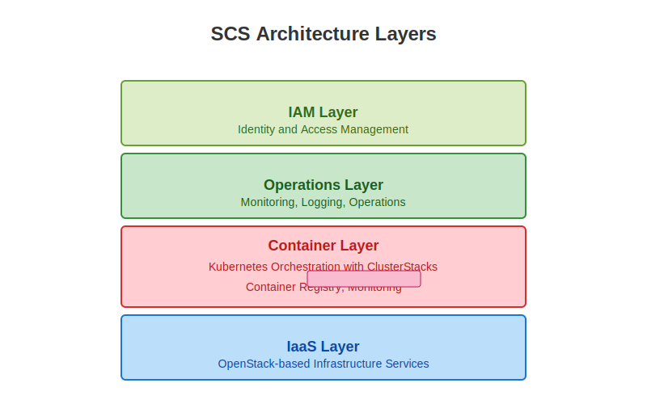

# SCS Cluster Stacks

Note:
- We're starting with Cluster Stacks, the foundation of the SCS Container Layer
- This component provides standardized Kubernetes cluster life-cycle management
- We'll cover the architecture, components, and practical implementation
- By the end of this section, you'll be able to deploy and manage K8s clusters using Cluster Stacks

----

## SCS Architecture Overview

- SCS provides a full stack for sovereign cloud infrastructure:
- **IaaS Layer**: OpenStack-based infrastructure services
<!-- .element: class="fragment" data-fragment-index="0" -->
- **Container Layer**: Kubernetes orchestration with ClusterStacks
<!-- .element: class="fragment" data-fragment-index="1" -->
- **Operations Layer**: Monitoring, logging, and operations
<!-- .element: class="fragment" data-fragment-index="2" -->
- **IAM Layer**: Identity and access management
<!-- .element: class="fragment" data-fragment-index="3" -->

Note:
- SCS is a reference implementation for sovereign cloud infrastructure
- The architecture consists of four main layers working together
- ClusterStacks is a cornerstone of the SCS Container Layer
- It bridges the gap between the IaaS layer and containerized applications
- The Container Layer provides standardized Kubernetes distributions that respect sovereignty
- ClusterStacks enables infrastructure teams to provide Kubernetes-as-a-Service to their organization
- This layered approach ensures each component is modular but integrates seamlessly
- The entire stack is designed with digital sovereignty as a core principle

----

## What Are Cluster Stacks?
A framework and reference implementations for defining and managing Kubernetes clusters

- Standardize cluster deployments with declarative configurations
<!-- .element: class="fragment" data-fragment-index="0" -->
- Build on Cluster API (CAPI) for Kubernetes-native life-cycle management
<!-- .element: class="fragment" data-fragment-index="1" -->
- Combine Kubernetes components and add-ons as tested distributions
<!-- .element: class="fragment" data-fragment-index="2" -->
- Ensure version compatibility and upgrade paths
<!-- .element: class="fragment" data-fragment-index="3" -->

Note:
- Cluster Stacks provide a standardized approach to K8s cluster management
- They're built on Cluster API (CAPI), a Kubernetes SIG project for cluster life-cycle management
- The key innovation is combining both core K8s configuration and essential add-ons (like CNI)
- Each Cluster Stack is tested as a whole, ensuring components work together
- Think of them as distributions that define the entire cluster, not just the Kubernetes components
- This creates a reliable, reproducible way to deploy clusters across environments

----

## Why ClusterStacks Matters

- **Historical Context**: Evolution of Kubernetes management
- Manual cluster creation → Scripted deployment → Infrastructure as Code → Kubernetes-native management
<!-- .element: class="fragment" data-fragment-index="0" -->

- **Real-world Challenges Solved**:
- **Configuration Drift**: Without standardization, clusters diverge over time
<!-- .element: class="fragment" data-fragment-index="1" -->
- **Upgrade Complexity**: Coordinating upgrades across components is error-prone
<!-- .element: class="fragment" data-fragment-index="2" -->
- **Multi-cluster Management**: Manual approaches don't scale to dozens/hundreds of clusters
<!-- .element: class="fragment" data-fragment-index="3" -->
- **Vendor Lock-in**: Proprietary K8s services create dependency on specific providers
<!-- .element: class="fragment" data-fragment-index="4" -->

Note:
- The evolution of Kubernetes management has gone through several phases
- Early adopters created clusters manually, which was time-consuming and error-prone
- Scripted approaches improved consistency but lacked declarative benefits
- Infrastructure as Code tools like Terraform improved matters but weren't Kubernetes-native
- ClusterStacks represents the next evolution: Kubernetes-native, declarative, and comprehensive
- Configuration drift is a major issue in production - when clusters are created differently, they behave differently
- Upgrading Kubernetes is notoriously challenging, especially when add-ons need to be compatible
- As organizations scale to dozens or hundreds of clusters, manual management becomes impossible
- Vendor lock-in is particularly problematic for sovereignty - ClusterStacks enables freedom from proprietary services