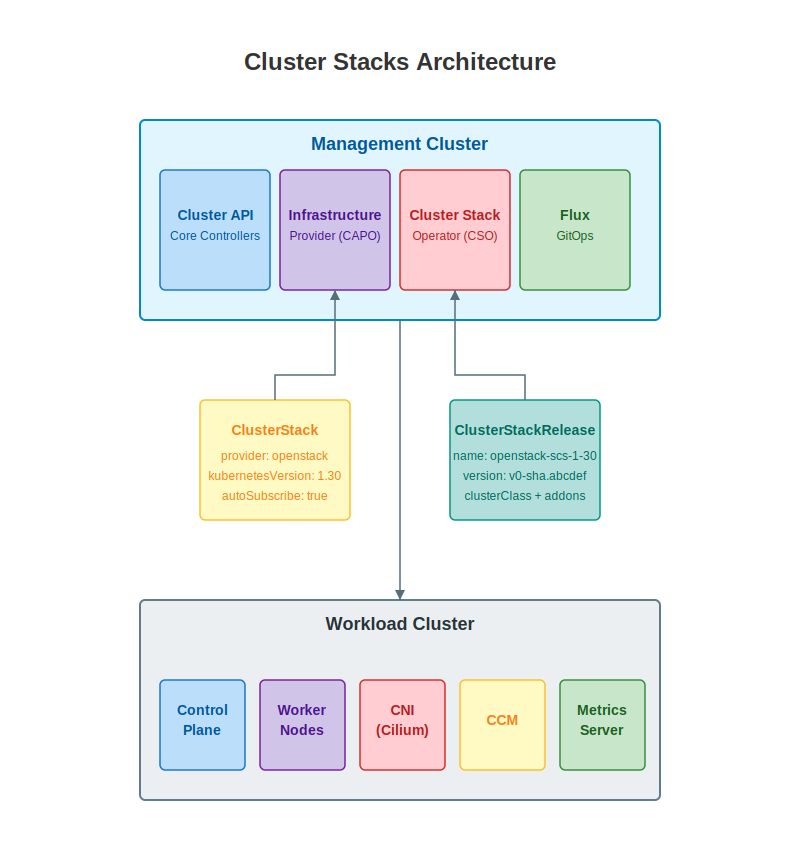
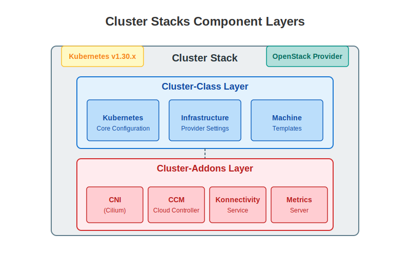
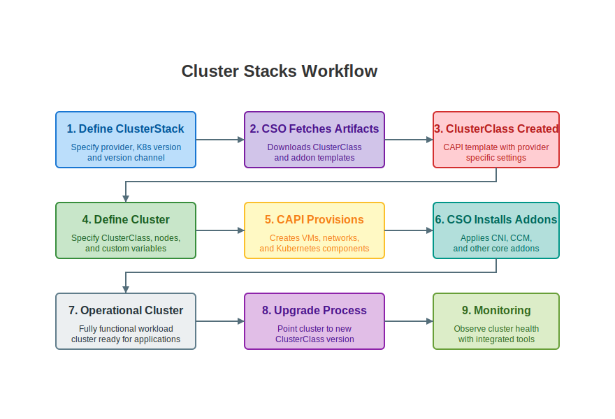
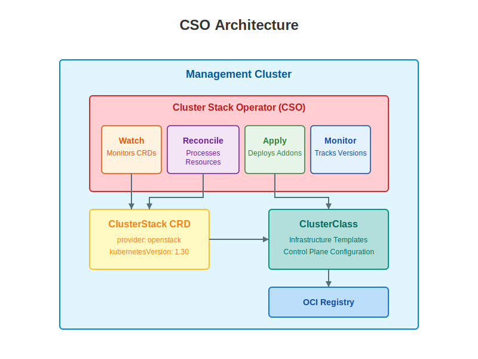

# ClusterStacks Architecture

Note:
- This section explains the architecture of ClusterStacks
- We'll cover the overall design, components, and workflow
- We'll also dive into how the ClusterStack Operator extends the Cluster API functionality
- Understanding this architecture is essential for working with ClusterStacks effectively

----

## Architecture Overview

- ClusterStacks follows a "managing Kubernetes with Kubernetes" pattern
<!-- .element: class="fragment" data-fragment-index="0" -->
- Uses a management cluster to create and manage workload clusters
<!-- .element: class="fragment" data-fragment-index="1" -->
- Extends **Cluster API (CAPI)**: Kubernetes project for declarative cluster management
<!-- .element: class="fragment" data-fragment-index="2" -->
- Provides declarative, version-controlled cluster definitions
<!-- .element: class="fragment" data-fragment-index="3" -->

Note:
- This diagram shows the high-level architecture of Cluster Stacks
- CAPI (Cluster API) is a Kubernetes sub-project that provides declarative APIs for creating and managing Kubernetes clusters
- There's a management cluster that runs the Cluster API controllers
- These controllers manage the lifecycle of workload clusters
- The architecture follows the "managing Kubernetes with Kubernetes" pattern
- Cluster Stack Operator (CSO) extends CAPI to work with Cluster Stacks
- Each workload cluster is defined by a ClusterStack that specifies both cluster configuration and add-ons
- This separation of concerns creates a clean, modular architecture

----

## Architecture Components

- ClusterStacks divides cluster management into two logical layers:
- **Cluster-class layer**: Core Kubernetes configuration and infrastructure
<!-- .element: class="fragment" data-fragment-index="0" -->
- **Cluster-addons layer**: Essential services including:
<!-- .element: class="fragment" data-fragment-index="1" -->
  - **CNI (Container Network Interface)**: Networking for pods
  - **CCM (Cloud Controller Manager)**: Integration with cloud providers
  - **Metrics Server**: Resource utilization monitoring
- Both layers are version-controlled and tested together
<!-- .element: class="fragment" data-fragment-index="2" -->

Note:
- Cluster Stacks are divided into two main logical layers
- The Cluster-class layer handles the core Kubernetes configuration:
  - Control plane setup, kubelet settings, API server configurations
  - Infrastructure-specific settings via CAPI providers
  - This is based on CAPI's ClusterClass feature, which defines a reusable blueprint for cluster topology
- The Cluster-addons layer provides essential services for a functional cluster:
  - CNI (Container Network Interface) is critical for pod networking (Cilium, Calico, etc.)
  - CCM (Cloud Controller Manager) interfaces with the cloud provider to manage cloud-specific resources
  - Other components like metrics server and Konnectivity service (a network proxy for secure control plane to node communication)
- Both layers are versioned together - a change in either triggers a version bump
- This ensures that all components are compatible and tested as a coherent unit

----

## Cluster Stacks Workflow

- End-to-end workflow for creating and managing clusters:
- **Define ClusterStack**: Specify provider, Kubernetes version, and components
<!-- .element: class="fragment" data-fragment-index="0" -->
- **Generate ClusterClass**: ClusterStack Operator creates a template from this definition
<!-- .element: class="fragment" data-fragment-index="1" -->
- **Define Cluster**: Reference the ClusterClass with desired configuration
<!-- .element: class="fragment" data-fragment-index="2" -->
- **Provision Infrastructure**: CAPI controllers create VMs, networks, etc.
<!-- .element: class="fragment" data-fragment-index="3" -->
- **Deploy Add-ons**: CSO installs networking, monitoring, and other components
<!-- .element: class="fragment" data-fragment-index="4" -->

Note:
- This diagram illustrates the end-to-end workflow of using Cluster Stacks
- It starts with defining a ClusterStack resource in the management cluster
- The CSO fetches the appropriate artifacts based on provider and K8s version
- A ClusterClass is created that provides the template for cluster creation
- Users define their desired cluster using this ClusterClass
- CAPI provisions the infrastructure and core Kubernetes components
- CSO installs the necessary add-ons like CNI and CCM
- The result is an operational workload cluster
- Later, upgrades can be performed by pointing to a newer ClusterClass
- Monitoring tools provide visibility into cluster health and performance

----

## Components & Responsibilities

### Cluster API Controllers and Resources
- **Cluster**: Represents a logical Kubernetes cluster
<!-- .element: class="fragment" data-fragment-index="0" -->
- **Machine**: Represents a single Kubernetes node (VM or physical server)
<!-- .element: class="fragment" data-fragment-index="1" -->
- **MachineSet/MachineDeployment**: Scalable sets of machines, similar to Deployments
<!-- .element: class="fragment" data-fragment-index="2" -->
- **CRD (Custom Resource Definition)**: Extends Kubernetes API with new resource types
<!-- .element: class="fragment" data-fragment-index="3" -->

### Control Flow Between Components
- CAPI handles infrastructure lifecycle
<!-- .element: class="fragment" data-fragment-index="4" -->
- CSO extends with add-on management
<!-- .element: class="fragment" data-fragment-index="5" -->
- Creation flow: ClusterStack → ClusterClass → Cluster → Machines → Add-ons
<!-- .element: class="fragment" data-fragment-index="6" -->

Note:
- Cluster API defines several custom resources for managing clusters
- CRDs (Custom Resource Definitions) allow Kubernetes to be extended with new resource types
- The Cluster resource represents the entire Kubernetes cluster
- Machines are individual nodes (control plane or worker nodes)
- MachineSets and MachineDeployments provide scaling capabilities similar to ReplicaSets/Deployments
- The technical control flow is important to understand:
  1. User creates a ClusterStack resource
  2. CSO processes this and creates a ClusterClass
  3. User references the ClusterClass in a Cluster resource
  4. CAPI creates the infrastructure (Machines) based on the Cluster spec
  5. Once infrastructure is ready, CSO deploys add-ons
  6. The result is a fully functional cluster with both core K8s and necessary add-ons
- This separation of concerns provides a clean architecture
- For technical teams, understanding this flow is crucial for troubleshooting

----

## ClusterStack Operator (CSO) Deep Dive

The ClusterStack Operator (CSO) is the central controller that enables the ClusterStacks concept:

- **Technical Problem Solved**: Bridges the gap between infrastructure provisioning and add-on management
<!-- .element: class="fragment" data-fragment-index="0" -->
- **Extended CAPI Functionality**: Transforms a ClusterStack definition into a fully functional ClusterClass
<!-- .element: class="fragment" data-fragment-index="1" -->
- **Component Coordination**: Manages versioned relationships between core K8s and required add-ons
<!-- .element: class="fragment" data-fragment-index="2" -->
- **Kubernetes Operator Pattern**: Follows a controller model using Kubebuilder framework
<!-- .element: class="fragment" data-fragment-index="3" -->

Note:
- The CSO is built on the Kubernetes Operator pattern
- It solves the critical problem that CAPI alone doesn't address: management of cluster add-ons
- While CAPI handles infrastructure provisioning, it has no concept of add-ons like CNI, metrics-server, etc.
- The CSO introduces the ClusterStack CRD which combines Kubernetes versions with compatible add-ons
- It translates ClusterStack definitions into ClusterClass resources that CAPI can understand
- This ensures that when a cluster is provisioned, it gets both infrastructure and necessary add-ons
- The versioned nature of ClusterStacks ensures that all components work together properly
- The operator implements a control loop using the Kubebuilder framework, which is a framework for building Kubernetes APIs
- Technical teams can customize the ClusterStack definitions to standardize their deployments

----

## CSO Technical Architecture

- CSO implements a standard Kubernetes controller pattern:
- **Watch**: Monitors ClusterStack and Cluster resources 
<!-- .element: class="fragment" data-fragment-index="0" -->
- **Reconcile**: Creates ClusterClass from ClusterStack definition
<!-- .element: class="fragment" data-fragment-index="1" -->
- **Apply**: Manages add-on deployments after CAPI creates infrastructure
<!-- .element: class="fragment" data-fragment-index="2" -->
- **Monitor**: Tracks version compatibility across components
<!-- .element: class="fragment" data-fragment-index="3" -->

Note:
- The CSO follows the Kubernetes operator pattern with a control loop
- It watches for ClusterStack resource changes and creates/updates ClusterClasses accordingly
- When a ClusterStack is created, the CSO pulls the appropriate artifacts from the OCI registry
- It extends CAPI's functionality by managing the cluster add-ons layer
- The operator ensures that the add-ons are compatible with the Kubernetes version
- When a cluster is created, the CSO waits for CAPI to provision the infrastructure
- Once the infrastructure is ready, the CSO deploys the add-ons to the cluster
- This separation of concerns allows for modular cluster management
- The CSO is implemented using the Kubebuilder framework for Kubernetes operators
- For a technical audience, understanding this control flow is critical to troubleshooting
- The CSO also handles versioning and upgrade paths between different ClusterStack versions