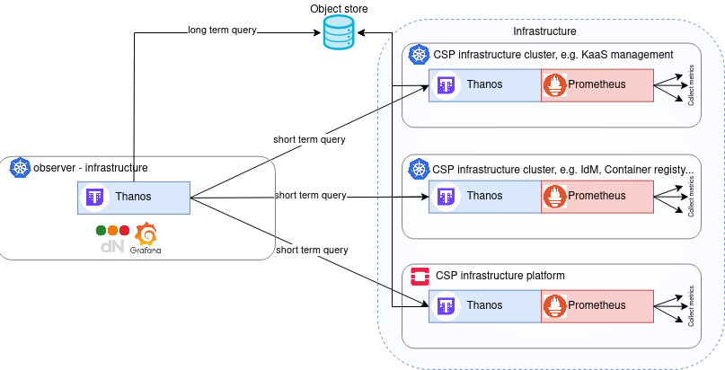

##  Course Overview

This course provides an introduction to SCS Monitoring, a scalable, highly available monitoring stack based on Prometheus, Thanos, Grafana and Loki. The course contains brief overview of used technologies as well as examples and demonstrations using KinD.
## Table of Contents
1. [Introduction](#1-introduction)
2. [Motivation and Use Cases](#2-motivation-and-use-cases)
3. [Monitoring Overview](#3-monitoring-overview)
4. [Example Deployments](#4-example-deployments)
5. [Dashboards and Customization](#5-dashboards-and-customization)
6. [Appendices and Resources](#6-appendices-and-resources)
## 1. Introduction
- Course goals - TODO
- Technologies covered: KinD, Helm, Kubernetes, Prometheus, Thanos, Loki, Grafana
- What to expect by the end of this course - TODO

## 2. Motivation and Use Cases
Monitoring means real-time metrics and logs that inform the operator about current infrastructure state and possible problems. Monitoring makes it easy to detect problems and makes it easier to force
The main features of SCS Monitoring:
- Highly available
- Scalable
- Global view
- Long term metrics and logs
- Infrastructure layer monitoring
- IaaS layer monitoring
- Various types of metrics (Prometheus, StatsD)
- Highly modular
- Highly extensible
- Alerting
- Matrix chat notifications
## 3. Monitoring Overview
This section provides brief explanation of SCS monitoring stack and it's components.

### 3.1. Visualisation and Data Layer

 

- **Data Layer** - for scraping/exporting metrics and logs 
	- Prometheus - real-time metrics and alerts based on time-series data.
	- Exporters (Node exporter,SSL exporter) - exposing metrics for Prometheus
	- Thanos - long-term storage, high availability, multi-cluster
	- Loki - log aggregation
- **Visualization layer** 
	- Grafana - analytics and visualization
	- dNation K8S Monitoring - series of intuitive, drill-down Grafana dashboards
### 3.2. Multicluster monitoring

- **Workload Cluster** - Contains data layer only. Uses Prometheus to scrape metrics and Thanos  to store longterm metrics in an objectstore service 
- **Observer cluster** - Contains both data and visual layer. Utilizes Thanos with  Envoy proxy  for short term queries multiple clusters, hosts and IAASs, including the observer cluster itself. Uses Grafana to display dNation dashboards, as well as any aditional dashboards.  For Long term Querries it looks into the objectstore service 

### 3.3. IAAS Monitoring

IaaS monitoring  uses openstack exporter. The user needs to supply credentials in form of `clouds.yaml` Currently, there's no dNation dashboard, we recommend to use [this dashboard](https://grafana.com/grafana/dashboards/21085-openstack-overview/). See [Dashboards and Customization](#5-dashboards-and-customisation) on how to add 3rd party dashboards.
## 4. Example Deployments
This section provides example deployments of single-cluster, multi-cluster and IAAS monitoring as
### 4.1. Quickstart Guide
- Create KinD cluster
 
```shell
kind create cluster --config kind-observer-config.yaml --image kindest/node:v1.31 --name observer
```

- Install monitoring stack 

```shell
helm repo add dnationcloud https://dnationcloud.github.io/helm-hub/
helm repo update dnationcloud
helm upgrade --install dnation-kubernetes-monitoring-stack dnationcloud/dnation-kubernetes-monitoring-stack -f values-observer.yaml
```

- Portforward to Grafana
```bash
export POD_NAME=$(kubectl get pods --namespace default -l "app.kubernetes.io/name=grafana,app.kubernetes.io/instance=monitoring" -o jsonpath="{.items[0].metadata.name}")
kubectl --namespace default port-forward $POD_NAME 3000
```

- Access monitoring [http://localhost:30000/d/monitoring/infrastructure-services-monitoring](http://localhost:30000/d/monitoring/infrastructure-services-monitoring)
### 4.2. Multicluster Monitoring
>Todo
### 4.3 IAAS Monitoring
>Todo

## 5. Dashboards and Customization
>Todo
 

## 6 Appendices and Resources

### 6.1.  ETCD, Kube-Proxy fix
- The metrics of `etcd` and `kube-proxy` control plane components are by default bound to the localhost that prometheus instances **cannot** access.
- When spawning a new cluster (`kubeadm init`) you can use our config
```bash
kubeadm init --config=helpers/kubeadm_init.yaml
```

- On existing clusters, access the node via SSH and do the following 
```bash
# On k8s master node
cd /etc/kubernetes/manifests/
sudo vim etcd.yaml
```
```yaml
# Add listen-metrics-urls as etcd command option
...
- --listen-metrics-urls=http://0.0.0.0:2381
...
```
### 6.2. Resources
[SCS Monitoring Documentation](https://docs.scs.community/docs/operating-scs/components/monitoring/docs/overview)
